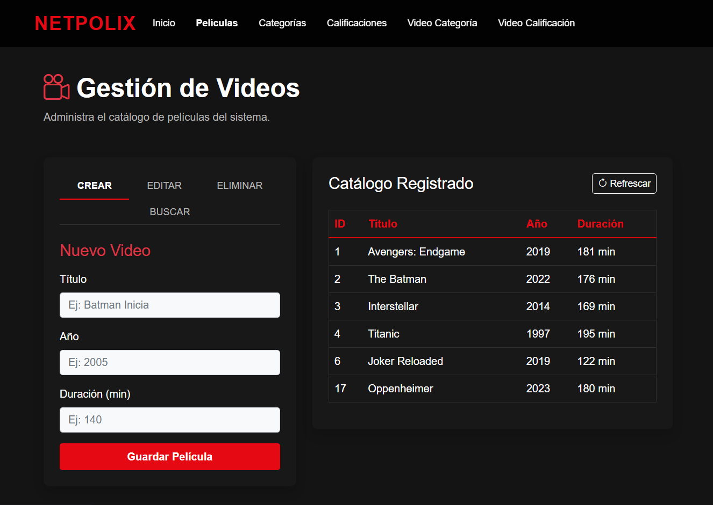
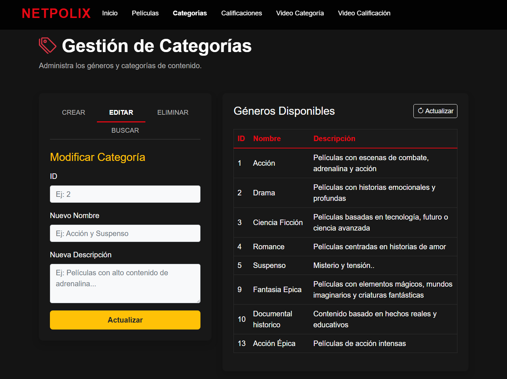
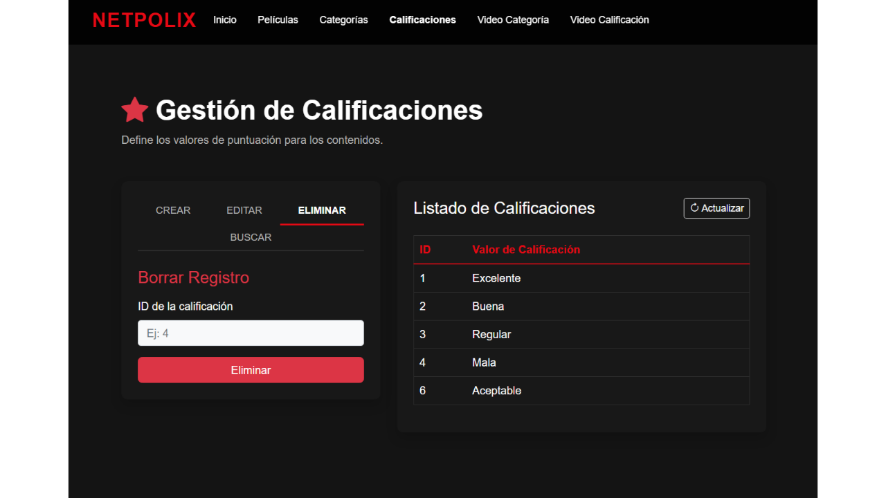
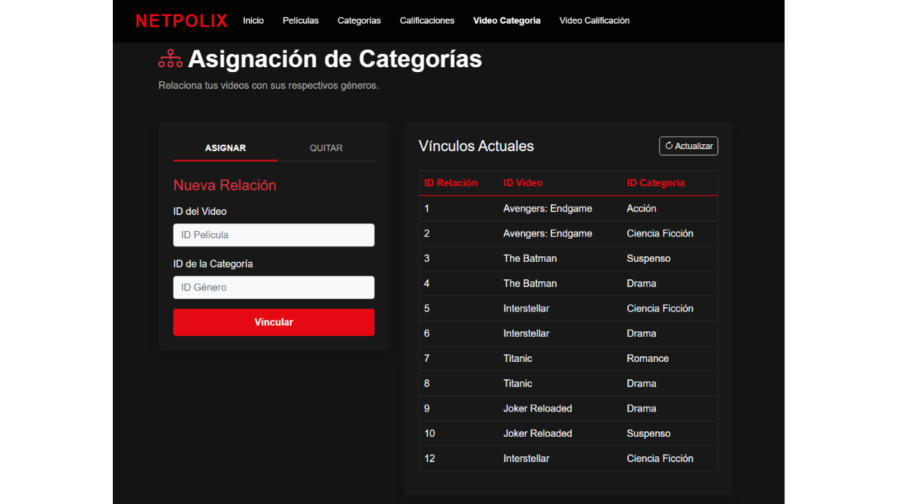
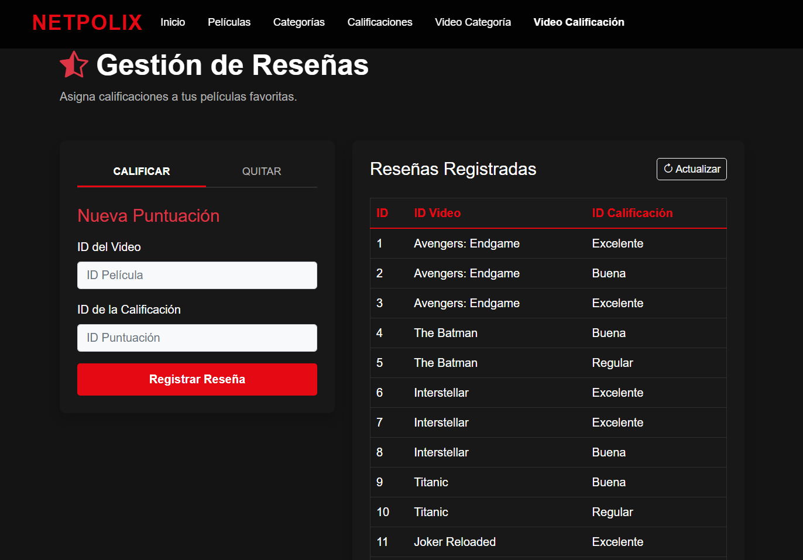

# NETPOLIX - Flask Web Application

Sistema web de gestión de videos desarrollado con Flask, SQLAlchemy, MySQL, Bootstrap 5 y JavaScript.

---

## Características

- Gestión de categorías
- Gestión de calificaciones
- Gestión de videos
- Relaciones video-categoría
- Relaciones video-calificación
- API REST con Flask
- Cliente web con Bootstrap 5
- Consumo de API usando fetch()
- Arquitectura cliente-servidor

---

## Capturas del sistema

### Inicio Netpolix


### Gestión de Videos



### Gestión de Categorías



### Gestión de Calificaciones



### Relaciones Video Categoría



### Relaciones Video Calificación



---

## Tecnologías utilizadas

### Backend

- Python
- Flask
- Flask-CORS
- SQLAlchemy
- MySQL

### Frontend

- HTML5
- Bootstrap 5
- JavaScript
- Bootstrap Icons

---

## Instalación

```bash
pip install -r requirements.txt
```

---

## Ejecutar proyecto

```bash
python app.py
```

---

## Estructura del proyecto

```text
NETPOLIX/
│
├── app.py
├── conexion.py
├── models.py
├── requirements.txt
├── README.md
│
├── categorias.html
├── calificaciones.html
├── videos.html
├── videocategoria.html
├── videocalificacion.html
│
├── static/
│   ├── css/
│   │   └── styles.css
│   │
│   └── js/
│       ├── categorias.js
│       ├── calificaciones.js
│       ├── video.js
│       ├── videoCategoria.js
│       └── videoCalificacion.js
```

---

## Funcionalidades CRUD

### Categorías

- Crear categoría
- Listar categorías
- Buscar categorías

### Calificaciones

- Crear calificación
- Listar calificaciones
- Buscar calificaciones

### Videos

- Crear video
- Listar videos
- Buscar videos

### Video Categoría

- Crear relación video-categoría
- Mostrar nombres reales en tabla
- Buscar relaciones

### Video Calificación

- Crear relación video-calificación
- Mostrar nombres reales en tabla
- Buscar relaciones

---

## Arquitectura del proyecto

```text
Frontend (HTML + Bootstrap + JavaScript)
↓
Fetch API
↓
Flask API REST
↓
SQLAlchemy ORM
↓
MySQL
```

---

## Autor

Johan Moreno

Desarrollador de Software
